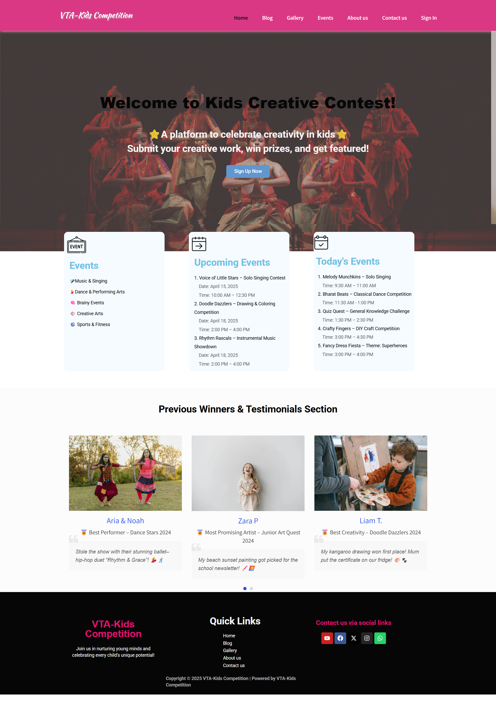

# VTA Kids Competition Management Portal

### 📝 Project Description
I developed this project for the Victorian Tamil Association (VTA) community in Australia. The main goal was to create a centralized online system to manage kids' competitions (like Drawing, Singing, and Quiz) which were previously managed manually.

This platform helps parents to register their children for events, check the event calendar, and see results online. It also helps the community admins to manage all participant data in one place.

### 🚀 Key Features I Implemented

* **Guest vs. User View:** Guest users can only see basic info. Once a parent logs in, they get access to a private Dashboard, Event Registration, and Results.

* **Automated Email System:**  When a parent registers for an event, an automated confirmation email is sent to both the Parent and the Admin.

* **Dynamic Event Calendar:** A dedicated section to show upcoming and past events with full details.

* **Searchable Result Board:** A table where parents can search for their child's name and download a participation certificate.

* **User Dashboard:** A simple profile management area for registered users to update their details.

### 🛠 Tech Stack & Plugins Used

I used WordPress as the core CMS and customized it using various professional tools:

* **Page Builder:** Elementor.

* **Forms & Automation:** WPForms for event registration and email triggers.

* **User Management:** User Registration Plugin for custom login/sign-up and role-based menus.

* **Data Management:** TablePress to create the searchable result leaderboard.

* **Event Management:** The Events Calendar for scheduling and organizing competitions.

* **Design Tools:** Canva for creating certificates.

### 💡 Challenges I Solved

* **Conditional Navigation:** It was challenging to hide/show menu items based on whether a user is logged in. I solved this by using conditional menu logic.

* **Data Organization:** Managing different age groups for results was tricky. I used TablePress with custom CSS to make it look clean and searchable.

* **Localhost to Production Logic:** Since it's a client project, I built it on a local environment (XAMPP) and prepared it for future deployment on the client's server.

### Workflow

Login -> Event Registration -> Email to User & Admin -> Result

### 📸 Project Screenshot (Home Page)

**You can see the full visual workflow in the /Screenshots folder of this repository** 

